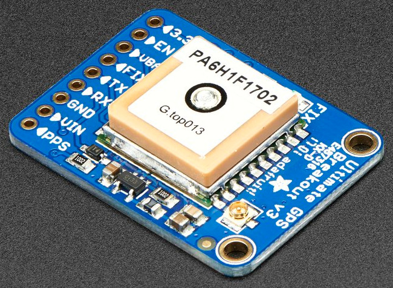

Adafruit Ultimate GPS
=====================

Python files to use the Ultimate GPS on the Beaglebone Black
Thanks to Paul McWhorter for this tutorial. [Beaglebone Black GPS](http://www.toptechboy.com/tutorial/beaglebone-black-gps-lesson-1-hooking-up-the-adafruit-ultimate-gps/)

| Board pin name | Board pin | Beaglebone Black pin name |
|----------------|-----------| --------------------------|
| 3.3V           | 1         | Not Used                  |
| EN             | 2         | Not Used                  |
| VBAT           | 3         | Not Used                  |
| FIX            | 4         | Not Used                  |
| TX             | 5         | P9\_26, UART1_TXD         |
| RX             | 6         | P9\_24, UART1_RXD         |
| GND            | 7         | P9\_1, Ground             |
| VIN            | 8         | P9\_7, VDD\_5v            |
| PPS            | 9         | Not Used                  |

